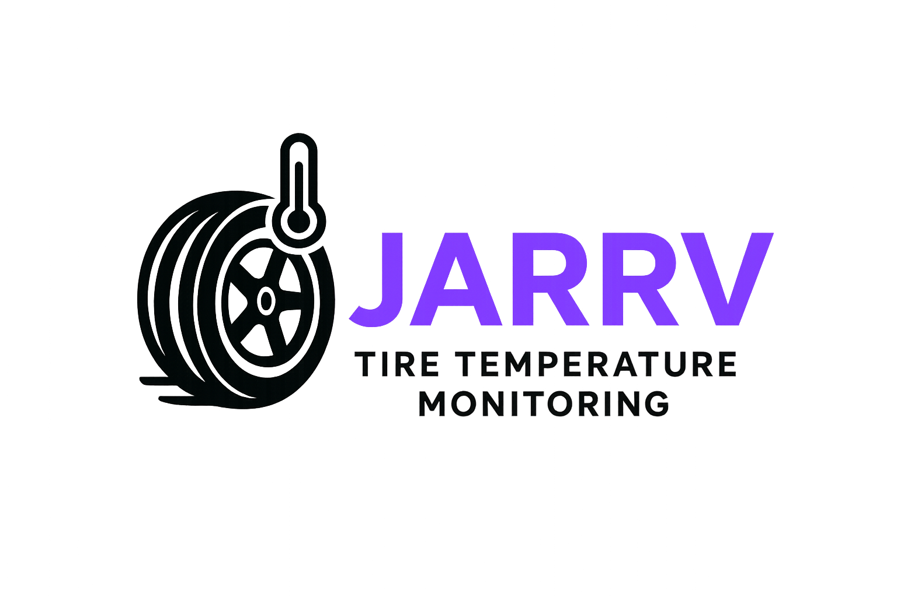

# tire-temperature-monitor

O sistema consiste em 4 sensores de temperatura infravermelho conectados a um microcontrolador ESP32-C3 Mini e um módulo can MCP2551. O sistema realizará a leitura dos sensores de temperatura e enviará os dados para o sistema de telemetria já existente. Além disso, será implementada uma interface gráfica em java para apresentar os dados recebidos.

# JARRV

  

### Desenvolvimento Ágil - EC46C - 2025/1

## Integrantes

| Membros |
|:-------|
| [Rafael Munhoz Castro](https://github.com/RafinhaW74) |
| [Vinícius Souza Dias](https://www.google.com/?hl=pt_BR) |
| [João Alberto Benaci](https://www.google.com/?hl=pt_BR) |
| [Arthur Henrique Jardim](https://www.google.com/?hl=pt_BR) |

## Objetivo
Desenvolver um 
