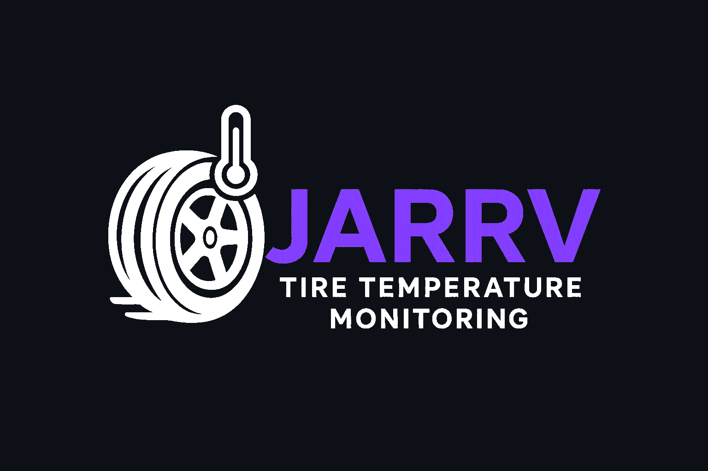

# JARRV

  <picture>
    <!-- Dark mode image -->
    <source srcset="imagens/LogoJARRVofc-dark.png" media="(prefers-color-scheme: dark)" />
    <!-- Light mode image -->
    <source srcset="imagens/LogoJARRVofc.png" media="(prefers-color-scheme: light)" />
    <!-- Default/fallback image -->
    
  </picture>

  

## Desenvolvimento Ágil - EC46C - 2025/2

 

## Integrantes
| [Rafael Munhoz Castro](https://github.com/RafinhaW74)   |
|:--------|
| [Vinícius Souza Dias](https://github.com/vinicius-10) |
| [João Alberto Benaci](https://github.com/k7vinilstorage) |
| [Arthur Henrique Jardim](https://github.com/arthur-hj)  |

  

## Objetivo
Desenvolver um sistema de monitoramento de temperatura de pneus para protótipo do projeto de extensão Fórmula CP, utilizando sensores infravermelho e um microcontrolador e enviar as leituras dos sensores para o sistema de telemetria já existente do projeto. Projetando uma interface gráfica para visualização dos dados.

  

## Público-Alvo
O público-alvo do projeto são os membros do projeto de extensão do Fórmula CP e entusiastas.

  

## Sobre o sistema
### tire-temperature-monitor
O sistema consiste em 4 sensores de temperatura infravermelho conectados a um microcontrolador ESP32-C3 Mini e um módulo can MCP2551. O sistema realizará a leitura dos sensores de temperatura e enviará os dados para o sistema de telemetria já existente. Além disso, será implementada uma interface gráfica em java para apresentar os dados recebidos.

  

## Protótipo de Alta Fidelidade
LINK: { https://www.figma.com/design/oQvmDR8uu1Z83s6j8ocahO/TTMS?node-id=0-1&t=0RBe8sDUXeY0sgaT-1 }
