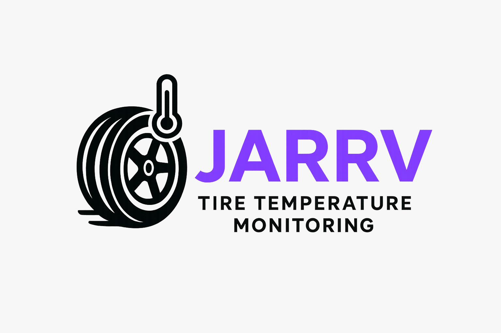

# JARRV

  

  

## Desenvolvimento Ágil - EC46C - 2025/1

 

## Integrantes

  | Membros |
  |:-------|
  | [Rafael Munhoz Castro](https://github.com/RafinhaW74) |
  | [Vinícius Souza Dias](https://www.google.com/?hl=pt_BR) |
  | [João Alberto Benaci](https://www.google.com/?hl=pt_BR) |
  | [Arthur Henrique Jardim](https://www.google.com/?hl=pt_BR) |

  

## Objetivo
Desenvolver um sistema de monitoramento de temperatura de pneus para protótipo do projeto de extensão Fórmula CP, utilizando sensores infravermelho e um microcontrolador e enviar as leituras dos sensores para o sistema de telemetria já existente do projeto. Projetando uma interface gráfica para visualização dos dados.

  

## Público-Alvo
O público-alvo do projeto são os membros do projeto de extensão do Fórmula CP e entusiastas.

  

## Sobre o sistema
### tire-temperature-monitor
O sistema consiste em 4 sensores de temperatura infravermelho conectados a um microcontrolador ESP32-C3 Mini e um módulo can MCP2551. O sistema realizará a leitura dos sensores de temperatura e enviará os dados para o sistema de telemetria já existente. Além disso, será implementada uma interface gráfica em java para apresentar os dados recebidos.
